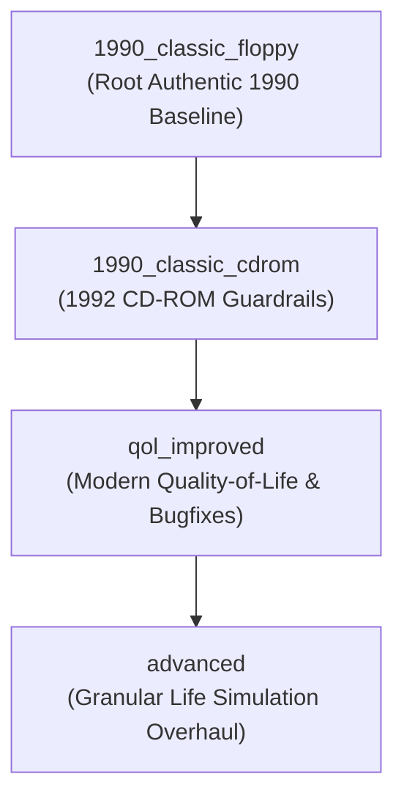

# Implementation & Campaign Variants Guide

This document is the **authoritative reference** for the mechanics of *The Fast Lane*, documenting:
1. The **authentic Sierra SCI bytecode implementation** (from the original 1990 Floppy and 1992 CD-ROM releases).
2. How our **Base campaigns** (`1990_classic_floppy` and `1990_classic_cdrom`) replicate the original game 1:1, including historical quirks and bugs.
3. How **Quality-of-Life Improved** (`qol_improved`) and **Advanced Edition** (`advanced`) modify, modernize, and expand the gameplay using modular **Optional Rules**.

> [!CAUTION]
> ### Golden Rule for AI Agents & Contributors
> **NEVER modify core engine math or fix bugs directly inside `1990_classic_floppy` or `1990_classic_cdrom`.**
> 
> If Sierra's original bytecode had a flaw, quirk, or harsh mechanic, the Classic Floppy and CD-ROM versions **must preserve it**.
> Any bugfix, quality-of-life improvement, or balance adjustment **must be gated behind an optional rule toggle** in [`src/engine/rules.ts`](file:///home/yoavh/code/antigravity/fastlane/src/engine/rules.ts). The rule is enabled (`true`) for `qol_improved` and `advanced`, while remaining disabled (`false` or original behavior) for `1990_classic_floppy` and `1990_classic_cdrom`.

---

## 1. Campaign Inheritance Hierarchy

The game uses a tiered inheritance model for campaign data and configurations:

### The 4 Campaign Editions

1. **`1990_classic_floppy` (Authentic 1990 Floppy Disk)**:
   * 1:1 replication of the original 1990 Sierra SCI0/SCI1 engine.
   * Full unconstrained economic depression down to `-90` (reading 10).
   * Retains authentic Sierra bugs (unreachable upside momentum bonus, infinite pawn arbitrage exploit, masked early job rejections, 2-hour re-entry fee).
   * Strict early-game cash starting at `` `$200` `` with Week 1 robbery risk.

2. **`1990_classic_cdrom` (Authentic 1992 CD-ROM Edition)**:
   * 1:1 replication of the 1992 Sierra multimedia re-release.
   * **Economic Safety Floor**: Enforces a reading floor of 70 (displayed `-30`), preventing infinite depression spirals.
   * **Event Pacing**: Pushes Market Crashes, Booms, and Willy muggings to start at Week 4 or Week 8 rather than Week 1.
   * **Charity Safety Net**: Grants charity payouts up to `` `$299` `` net worth (up from `` `$199` `` durable value in Floppy).
   * Still preserves Sierra bytecode bugs (unreachable upside bonus, pawn arbitrage, 2-hour re-entry fee).

3. **`qol_improved` (Quality-of-Life Improved)**:
   * Built on top of `1990_classic_cdrom`.
   * **Same authentic balance and rules**, but fixes known Sierra bytecode bugs and removes tedious UI friction.
   * Enables `helpfulUI` (explicit numbers, price breakdowns, transaction fees, and tier-specific clothing wear warnings).
   * Fixes the Sierra Script 107 bytecode bug via `economicUpsideBonus: true`.
   * Fixes infinite pawn money loop via `preventPawnArbitrage: true`.
   * Eliminates the 2-hour building re-entry penalty (`reenterCurrentLocationCost: false`).
   * Reveals explicit job rejection reasons from turn 1 (`maskEarlyJobRejections: false`).
   * Provides predictive financial journalism in the newspaper (`predictiveNewspaperStockTips: true`).

4. **`advanced` (Advanced Life Simulation Edition)**:
   * Built on top of `qol_improved`.
   * Expands the game into a deep, interconnected life simulation.
   * Replaces abstract Relaxation with distinct **Physical Condition** and **Mental Condition**.
   * Introduces domestic living mechanics: apartment **Mess & Cleaning**, **Space Capping**, and appliance breakdowns.
   * Adds **Social Standing** (1–99), **Work & Study Grind/Overtime Tiers**, and interactive **Card-Based Weekends**.
   * Introduces a 5th Victory Goal (**Wellbeing**) and depth-scaled degree bonuses (`depthScaledDegreeBonus: true`).

---

## 2. Subsystems: Authentic Implementation vs. Variants

### 2.1. Economy & Pricing Model

#### Authentic Sierra SCI Bytecode (Script 107 & Script 109)
* **Two Core State Variables**:
  1. `reading`: Market price level. Baseline is 100. Displayed in HUD as \(\text{Reading} = \text{reading} - 100\) (so 100 becomes `0`, 70 becomes `-30`, 108 becomes `+8`).
  2. `index` (Trend / Momentum): Integer from `-3` to `+3` indicating acceleration and direction.
* **8-Sector Hierarchical Architecture**:
  * **Tier 1**: Main Economy (`econ_main`) — drives macro trends.
  * **Tier 2**: Consumer Goods (`goods`) and General Investments (`investments`) — coupled to Main via \(\lfloor \text{mainIndex} / 3 \rfloor\).
  * **Tier 3**: Commodities (Gold, Silver, Pork Bellies) and Stocks (Blue Chip, Penny Stocks) — coupled to Investments via \(\lfloor \text{investIndex} / 3 \rfloor\).
* **Sector Step & Momentum Adjustment**:
  1. Mean-reversion checks set boundary flags:
     * High bounce flags: `reading < 80` (flag 2), `reading < 90` (flag 1).
     * Low bounce flags: `reading > 160` (flag 2), `reading > 130` (flag 1).
  2. Target roll: `target` is rolled in `[-3 - low, 3 + high]`. Momentum `index` nudges by \(\pm 1\) toward `target`.
  3. Dynamic adjustment range:
     * If `index > 0`: `lowerRange = -3`, `upperRange = 3 + 2 * index`.
     * If `index < 0`: `lowerRange = -3 + 2 * index`, `upperRange = 3`.
  4. Weekly change: Drawn uniformly from `[lowerRange, upperRange]` plus parent coupling \(\lfloor \text{parentIndex} / 3 \rfloor\).
* **Price Scaling (Script 109)**:
  \[
    \text{pct} = 100 + \left\lfloor \frac{(\text{reading} - 100) \times 5}{3} \right\rfloor = 100 + \left\lfloor \frac{\text{economicIndex} \times 5}{3} \right\rfloor
  \]
  \[
    \text{Price} = \max\left(1, \left\lfloor \frac{\text{basePrice} \times \text{pct}}{100} \right\rfloor\right) = \text{basePrice} + \left\lfloor \frac{\text{basePrice} \times \text{economicIndex}}{60} \right\rfloor
  \]

#### Market Crashes & Booms (Script 107)
* **Authentic Sierra Crash Formulas (Proportional, NOT flat!)**:
  * **Major Crash** (severity 1): \(\text{reading} = \lfloor (\text{reading} \times 17) / 20 \rfloor\) (**-15% reduction**). Momentum drops by 3 (`newIndex = max(-3, index - 3)`).
  * **Moderate Crash** (severity 2): \(\text{reading} = \lfloor (\text{reading} \times 18) / 20 \rfloor\) (**-10% reduction**).
  * **Minor Crash** (severity 3): \(\text{reading} = \lfloor (\text{reading} \times 19) / 20 \rfloor\) (**-5% reduction**).
* **Authentic Sierra Boom Formula**:
  * \(\text{reading} = \lfloor (\text{reading} \times 11) / 10 \rfloor\) (**+10% bump**). Momentum jumps to `+3`.
* *(Historical Note: A previous engine bug used a flat -50 point deduction during market crashes. That has been corrected across all versions to Sierra's authentic proportional reduction.)*

#### The Sierra Bytecode "Upside Bonus" Bug (`economicUpsideBonus`)
* **The Original Bug**: In `script.107.txt` lines 246–265, Sierra programmers wrote logic to reward an upside momentum bonus when a sector rolled its maximum range (`adjustment == upperRange`), mirroring the downside penalty when rolling `adjustment == lowerRange`. However, the conditional branch was structured inside an unreachable block in the compiled SCI bytecode.
* **Variant Resolution**:
  * `1990_classic_floppy` & `1990_classic_cdrom`: `economicUpsideBonus: false` (preserves the authentic bytecode bug).
  * `qol_improved` & `advanced`: `economicUpsideBonus: true` (unblocks the intended upside bonus).

#### Economic Floors: Floppy vs. CD-ROM
* `1990_classic_floppy`: Floor is reading `10` (displayed `-90`), allowing catastrophic 50-turn depressions.
* `1990_classic_cdrom`, `qol_improved`, `advanced`: Floor is reading `70` (displayed `-30`), capping maximum price drops at 50% of base price.

---

### 2.2. Pawn Shop & Financial Arbitrage (`preventPawnArbitrage`)

* **Authentic Sierra Quirk**:
  * In the original game, item purchase prices fluctuated with the economy, but pawn shop payout and buyback rates did not fully adjust dynamically.
  * During high economic booms, players could buy appliances or goods, immediately pawn them, and redeem/clear them in the same turn for guaranteed positive cash flow.
* **Variant Resolution**:
  * `1990_classic_floppy` & `1990_classic_cdrom`: `preventPawnArbitrage: false` (authentic behavior).
  * `qol_improved` & `advanced`: `preventPawnArbitrage: true` (dynamically adjusts pawn redemption and clearance prices with the economic index to prevent infinite-money loops).

---

### 2.3. Employment, Job Rejections & Careers

#### Early Job Rejection Masking (`maskEarlyJobRejections`)
* **Authentic Sierra Quirk (Script 206)**:
  * In weeks 1 through 4, if a player applied for a job and failed due to low dependability (which starts at 20, while many entry jobs require 30+), the clerk masked the rejection with the generic message `"There are no openings in that position right now."`
  * This was intended to avoid overwhelming new players with hidden stats, but caused immense frustration because players believed job availability was random.
* **Variant Resolution**:
  * `1990_classic_floppy` & `1990_classic_cdrom`: `maskEarlyJobRejections: true` (authentic masking).
  * `qol_improved` & `advanced`: `maskEarlyJobRejections: false` (the clerk explicitly tells you what stat or credential you are missing).

#### Job Switch Experience Bonus (`grantExpOnJobSwitch`)
* **Authentic Sierra Mechanics**:
  * Getting hired for any new job immediately granted `+2 Experience`.
* **Variant Resolution**:
  * `1990_classic_floppy`, `1990_classic_cdrom`, `qol_improved`: `grantExpOnJobSwitch: true`.
  * `advanced`: `grantExpOnJobSwitch: false` (prevents players from gaming stats by constantly hopping between entry-level jobs).

#### Job Archetype Tags (`showJobTags`)
* `advanced`: Displays tags like `Always Hiring`, `Frontline Service`, `Technical`, and `Management` to communicate career tracks.

---

### 2.4. Education, Degrees & Book Sets

#### Degree Stat Padding (`depthScaledDegreeBonus`)
* **Authentic Sierra Mechanics**:
  * Graduating with any university degree granted a flat `+5 Dependability`, `+5 Max Experience`, and `+5 Max Dependability`.
* **Variant Resolution**:
  * Classic & QoL: Flat `+5` bonus.
  * `advanced`: `depthScaledDegreeBonus: true` scales graduation bonuses by the prerequisite depth of the degree: `+(depth + 1)` instead of a flat `+5`.

#### 3-Book Set Lesson Credit (`delayBookSetCredit`)
* **Authentic Sierra Quirk**:
  * Purchasing a complete 3-book set (Trade, Business, Academic) grants a 1-lesson discount on courses. In Sierra SCI bytecode, this credit was only tallied at the start of the *next* turn.
* **Variant Resolution**:
  * `1990_classic_floppy` & `1990_classic_cdrom`: `delayBookSetCredit: true` (delayed credit).
  * `qol_improved` & `advanced`: `delayBookSetCredit: false` (instant credit on purchase).

---

### 2.5. Time, Movement & Building Re-Entry

#### Building Re-Entry Fee (`reenterCurrentLocationCost`)
* **Authentic Sierra Quirk (Script 001)**:
  * Entering any building cost 2 hours of time. If a player was already inside or at the doorstep of a building, closing the dialog and reopening it charged another 2 hours.
* **Variant Resolution**:
  * `1990_classic_floppy` & `1990_classic_cdrom`: `reenterCurrentLocationCost: true` (charges 2 hours).
  * `qol_improved` & `advanced`: `reenterCurrentLocationCost: false` (free to re-open current building).

#### Turn Start Location (`turnStartAtHome`)
* **Authentic Sierra Mechanics**:
  * At the start of a turn, players began wherever their marble stopped on the city sidewalk.
* **Variant Resolution**:
  * Classic & QoL: `turnStartAtHome: false`.
  * `advanced`: `turnStartAtHome: true` (players start the week inside their apartment, reinforcing the domestic routine).

---

### 2.6. Housing, Domestic Living & Space Capping

#### Eviction Strictness (`strictEviction`)
* **Authentic Sierra Mechanics**:
  * Eviction was lenient: rent arrears did not immediately trigger eviction if wage garnishment could cover payments.
* **Variant Resolution**:
  * `1990_classic_floppy`, `1990_classic_cdrom`, `qol_improved`: `strictEviction: false`.
  * `advanced`: `strictEviction: true` (warns at 1 month unpaid, evicts at >2 months unpaid).

#### Housing Space Capacity (`spaceCapping`)
* **Authentic Sierra Mechanics**:
  * Players could accumulate an infinite number of appliances and clothes in Low-Cost Housing.
* **Variant Resolution**:
  * Classic & QoL: `spaceCapping: false` (unlimited inventory).
  * `advanced`: `spaceCapping: true` (Low-Cost Housing holds 6 space; Security Apartments hold 14 space; Penthouse holds 28 space. Excess mess and durables cause overcrowding penalties).

#### Apartment Mess & Appliance Breakdown (`trackMess`, `advancedMaintenance`)
* `advanced`: Introduces dynamic apartment mess from cooking/relaxing, requiring manual cleaning or hiring a cleaning service. Appliances suffer wear-and-tear breakdowns requiring repair rather than simple cash replacements.

---

### 2.7. Health & Wellbeing Simulation

* **Classic & QoL Model**:
  * Single abstract `Relaxation` stat.
  * If relaxation falls below `10`, a random doctor visit may trigger at turn start.
  * `bypassDoctorIfBroke`: If the player has no cash or savings, the doctor visit is waived without penalty (`true` in Classic Floppy/CD-ROM and QoL).
* **Advanced Edition Model (`usePhysicalMentalConditions: true`)**:
  * Splits health into distinct **Physical Condition** (bodily stamina, diet, nutrition) and **Mental Condition** (cognitive resilience, stress tolerance).
  * Work and study are divided into three operational tiers:
    * **Normal** (Actions 1–3): Standard stamina costs.
    * **Grind** (Actions 4–7): Dual physical/mental drain.
    * **Overtime / Hyper-Accelerating** (Actions 8+): Severe compounding exhaustion.
  * Replaces random doctor events with explicit emergency medicine, self-care bounce-backs, and Low Spirits recovery.

---

## 3. Comprehensive Rule Toggles Comparison Matrix

| Rule Key | Description | Floppy (`1990_classic_floppy`) | CD-ROM (`1990_classic_cdrom`) | QoL (`qol_improved`) | Advanced (`advanced`) |
|---|---|:---:|:---:|:---:|:---:|
| `minEconomicReading` | Lowest possible economic reading index | `-90` (reading 10) | `-30` (reading 70) | `-30` (reading 70) | `-30` (reading 70) |
| `economicUpsideBonus` | Fixes Sierra bytecode bug to enable upper-range momentum bonus | `false` | `false` | **`true`** | **`true`** |
| `preventPawnArbitrage` | Scales pawn redemption/clearance with economy to block infinite money loop | `false` | `false` | **`true`** | **`true`** |
| `maskEarlyJobRejections` | Masks low dependability rejections as "No openings" in weeks 1–4 | `true` | `true` | **`false`** | **`false`** |
| `helpfulUI` | Displays exact prices, fees, and specific clothing wear warnings in UI | `false` | `false` | **`true`** | **`true`** |
| `enableAnimations` | Enables transaction popups and UI animations | `false` | `false` | **`true`** | **`true`** |
| `predictiveNewspaperStockTips`| Enables predictive stock market tips in the weekly newspaper | `false` | `false` | **`true`** | **`true`** |
| `reenterCurrentLocationCost` | Charges 2 hours travel cost to re-enter current building | `true` | `true` | **`false`** | **`false`** |
| `delayBookSetCredit` | Requires waiting until next turn for 3-book set lesson discount | `true` | `true` | **`false`** | **`false`** |
| `strictEviction` | Evicts player from apartment if rent debt exceeds 2 months | `false` | `false` | `false` | **`true`** |
| `turnStartAtHome` | Starts weekly turn inside apartment rather than city sidewalk | `false` | `false` | `false` | **`true`** |
| `grantExpOnJobSwitch` | Grants `+2` Experience immediately upon being hired for a new job | `true` | `true` | `true` | **`false`** |
| `depthScaledDegreeBonus` | Scales graduation stat bonuses by degree prerequisite depth | `false` | `false` | `false` | **`true`** |
| `usePhysicalMentalConditions` | Splits abstract relaxation into Physical and Mental condition stats | `false` | `false` | `false` | **`true`** |
| `trackMess` | Enables domestic apartment mess tracking and cleaning | `false` | `false` | `false` | **`true`** |
| `trackSocial` | Tracks Social standing stat (1–99) | `false` | `false` | `false` | **`true`** |
| `spaceCapping` | Limits inventory durables and mess by housing space capacity | `false` | `false` | `false` | **`true`** |
| `advancedMaintenance` | Appliances break and require repair rather than auto-fixing | `false` | `false` | `false` | **`true`** |
| `alternativeWeekends` | Presents card-based weekend choices rather than automated rolls | `false` | `false` | `false` | **`true`** |
| `showJobTags` | Displays career archetype tags in Employment Office | `false` | `false` | `false` | **`true`** |
| `advancedHomeGUI` | Uses visual apartment showcase for Home | `false` | `false` | `false` | **`true`** |
| `advancedWorkGUI` | Uses card-based work shift console for workplaces | `false` | `false` | `false` | **`true`** |
| `autoEquipBestClothes` | Automatically equips the best clothes in inventory for current job | `true` | `true` | `true` | **`false`** |
| `bypassDoctorIfBroke` | Waives mandatory doctor visit if player has no cash or savings | `true` | `true` | `true` | **`false`** |
| `marketCrashStartWeek` | Earliest turn week when market crashes can occur | `4` | `8` | `8` | `8` |
| `economicBoomStartWeek` | Earliest turn week when economic booms can occur | `4` | `8` | `8` | `8` |
| `willyRobberyStartWeek` | Earliest turn week when Willy muggings can occur | `1` | `4` | `4` | `4` |

---

## 4. Checklist for Future Engine & Rule Modifications

Before making changes to any game engine math or rules, follow this checklist:

1. **Identify the Target Scope**:
   * Is this an authentic Sierra mechanic, a bugfix, or a new feature?
   * If it's a bugfix for authentic Sierra behavior, **do not alter the Classic Floppy or CD-ROM behavior**. Create or reuse an optional rule in `GameRules`.
2. **Verify Against Bytecode**:
   * Check [`original_resources/README.md`](file:///home/yoavh/code/antigravity/fastlane/original_resources/README.md) and the corresponding `original_resources/floppy/script.*.txt` file to verify how Sierra actually handled the mechanic.
3. **Configure the Campaign JSONs**:
   * Set the default value in `DEFAULT_GAME_RULES` in [`src/engine/rules.ts`](file:///home/yoavh/code/antigravity/fastlane/src/engine/rules.ts).
   * Update `public/campaigns/1990_classic_floppy/config.json`, `public/campaigns/1990_classic_cdrom/config.json`, `public/campaigns/qol_improved/config.json`, and `public/campaigns/advanced/config.json`.
4. **Update the Comparison UI & Documentation**:
   * Ensure `RULE_DESCRIPTIONS` in [`src/engine/rules.ts`](file:///home/yoavh/code/antigravity/fastlane/src/engine/rules.ts) has a clear human-readable description.
   * Verify the rule appears properly in the in-game **Rules Comparison Screen** ([`src/ui/RulesScreen.tsx`](file:///home/yoavh/code/antigravity/fastlane/src/ui/RulesScreen.tsx)).
   * Update this document and [`original_resources/README.md`](file:///home/yoavh/code/antigravity/fastlane/original_resources/README.md).
